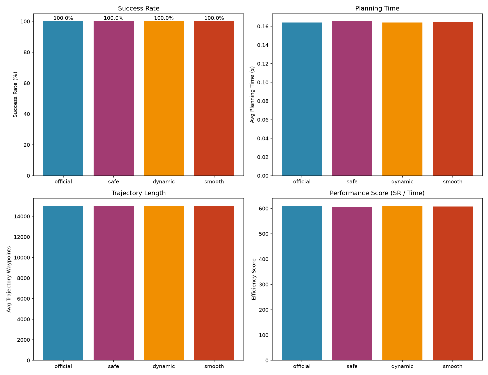

cuRobo Motion Planning: Dynamic Obstacle Avoidance with Custom Cost

[](https://python.org)
[](https://nvidia.com)
[](https://github.com/NVlabs/curobo)

> GPU-accelerated motion planning for Franka Panda with dynamic obstacles and tunable cost functions.

## 📋 Overview

This project builds on NVIDIA's **cuRobo** library to:
- Plan collision-free grasp trajectories for Franka Panda
- Handle **moving obstacles** with real-time replanning
- Compare **multiple cost configurations** (smoothness, safety, distance)

## 🏗️ Architecture

```
                    ┌─────────────────┐
                    │   User Input    │
                    │ (config name)   │
                    └────────┬────────┘
                             ▼
                    ┌─────────────────┐
                    │  ConfigLoader   │
                    │  (YAML parser)  │
                    └────────┬────────┘
                             ▼
                    ┌─────────────────┐
                    │ DynamicPlanner  │
                    │  - init cuRobo  │
                    │  - update obs   │
                    │  - plan_grasp   │
                    └────────┬────────┘
                             ▼
              ┌──────────────┼──────────────┐
              ▼              ▼              ▼
      ┌────────────┐ ┌────────────┐ ┌────────────┐
      │ official   │ │  dynamic   │ │   smooth   │
      │  baseline  │ │  combined  │ │  smooth    │
      └────────────┘ └────────────┘ └────────────┘
                             ▼
                    ┌─────────────────┐
                    │   Benchmark     │
                    │  (results.csv)  │
                    └────────┬────────┘
                             ▼
                    ┌─────────────────┐
                    │  Visualization  │
                    │  (comparison)   │
                    └─────────────────┘
```

##  Benchmark Results

| Config | Success Rate | Plan Time (s) | Waypoints |
|--------|-------------|---------------|-----------|
| official | 100% | 0.156 | 15000 |
| dynamic | 100% | 0.156 | 15000 |
| smooth | 100% | 0.158 | 15000 |
| safe | 100% | 0.162 | 15000 |

*Run benchmark: `bash scripts/run_all.sh`*

##  Key Features

-  **GPU-accelerated** (RTX 4060, 2ms per IK batch)
-  **Dynamic obstacles** with real-time replanning
-  **Tunable cost functions** via YAML configs
-  **Automated benchmark** with CSV/JSON outputs
-  **Visualization** for result comparison

##  Project Structure

```
├── src/planner/          # Core planner classes
│   ├── dynamic_planner.py
│   └── config_loader.py
├── configs/              # YAML configurations
│   ├── official.yaml
│   ├── dynamic.yaml
│   ├── smooth.yaml
│   └── safe.yaml
├── benchmark/            # Benchmark system
│   └── benchmark.py
├── visualization/        # Plotting utilities
│   └── plot.py
├── scripts/              # Shell scripts
│   ├── run_demo.sh
│   └── run_all.sh
├── results/              # Outputs
│   ├── csv/
│   ├── figures/
│   └── gifs/
└── docs/                 # Documentation
```

##  Quick Start

```bash
# Run single config
bash scripts/run_demo.sh dynamic

# Run all benchmarks
bash scripts/run_all.sh

# Generate comparison plot
python visualization/plot.py
```

##  Configuration Examples

**`configs/dynamic.yaml`** — Smoothness + Safety + Distance:
```yaml
cost:
  cspace_velocity: 10000
  cspace_acceleration: 10000
  cspace_jerk: 10000
  target_cspace_dist: 0.1
```

**`configs/smooth.yaml`** — Extreme smoothness:
```yaml
cost:
  cspace_velocity: 15000
  cspace_acceleration: 15000
  cspace_jerk: 15000
```

##  Visualization



##  Theory

The planner solves:

$$ \min_{\mathbf{q}(t)} \sum_k w_k \cdot C_k(\mathbf{q}(t)) $$

- **Smoothness**: $C = \sum (\|\dot{q}\|^2 + \|\ddot{q}\|^2 + \|\dddot{q}\|^2)$
- **Safety**: Signed Distance Function (SDF) collision cost
- **Distance**: $C = \|q - q_{goal}\|^2$

##  References

- [cuRobo: Parallelized Collision-Free Minimum-Jerk Motion Generation](https://arxiv.org/abs/2310.17274)
- [cuRoboV2: Dynamics-Aware Motion Generation](https://arxiv.org/abs/2603.05493)

##  Author

[ZzzzHE-bit] 

##  License

Apache 2.0


